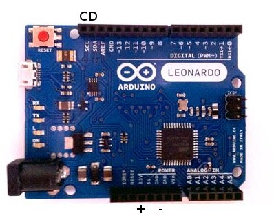
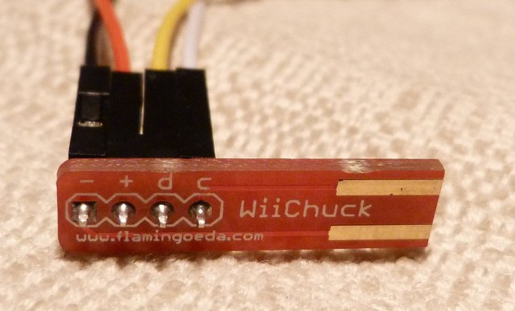
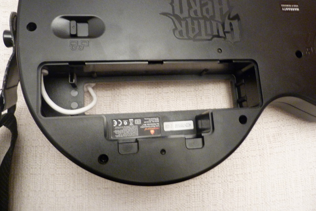
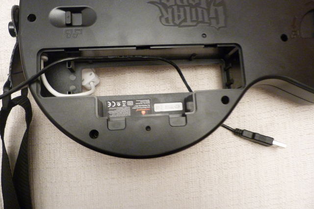
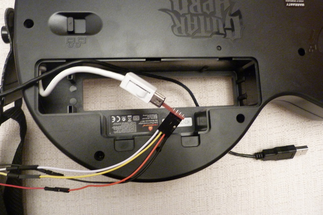
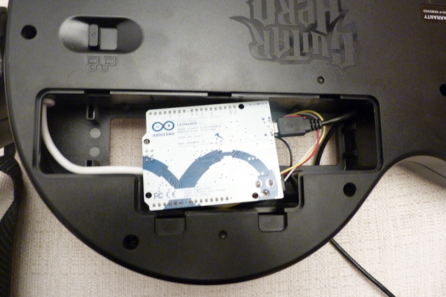
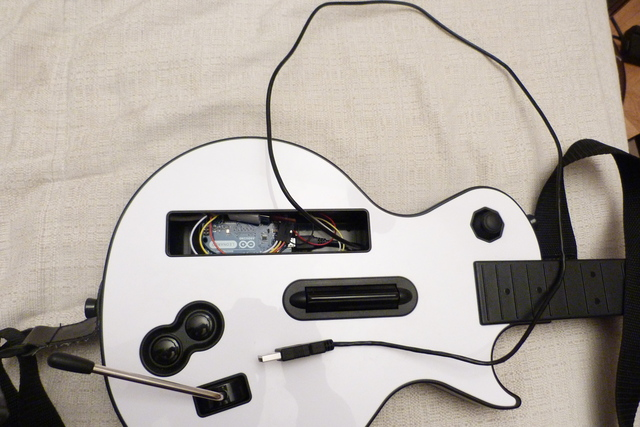

Jouer à Frets On Fire avec une Guitare Wii
------------------------------------------

Présentation
............

Ce tutorial vous permettra de :

* Découvrir la nouvelle capacité de l'arduino leonardo
* Faire votre premier montage arduino sans soudure et sans vous ruiner
* Utiliser votre guitare Wii sans Wii et sans Wiimote
* Jouer avec une vrai-fausse guitare à un logiciel libre plutôt qu'avec votre clavier

On supposera que vous connaissez les bases de l'utilisation d'un sketch arduino (compilation, upload).

Logiciel
........

* Arduino 1.0.1 ou supérieur

Matériel
........

* Une guitare wii
* `Une arduino leonardo <http://www.evola.fr/product_info.php/arduino-leonardo-avec-headers-p-278>`_
* `Un cable micro usb <http://www.evola.fr/product_info.php/cable-micro-usb-p-149>`_
* `Un Adaptateur Nunchuck Wii <http://www.evola.fr/product_info.php/adaptateur-nunchuck-wii-p-169>`_
* 4 jumpers male-femelle ou

  - `4 jumpers male <http://www.evola.fr/product_info.php/cable-jumper-femelle-pack-p-134>`_
  - `4 jumpers femelle <http://www.evola.fr/product_info.php/pack-jumpers-p-88>`_

Branchement de l'adaptateur
...........................

Sur l'adaptateur Wii vous pourrez trouver les signes -, +, d, c que nous allons relier à l'arduino :

========  ==============================  ================  ====================
Adapteur  Signification                   Couleur de cable  Port sur la leonardo
========  ==============================  ================  ====================
``-``     La masse                        Noir              GND
``+``     L'alimentation                  Rouge             3.3v
``d``     le signal de données i2c (SDA)  Jaune             SDA
``c``     le signal d'horloge i2c (SCL)   Blanc             SCL
========  ==============================  ================  ====================

Programmation de l'arduino
..........................

Téléchargez la biblothèque de gestion de périphérique wii et installez la dans le répertoire ``libraries`` du sdk::
	
	cd arduino-1.0.1
	cd libraries
	git clone git@github.com:simkim/ArduinoWExtension.git

Lancez le logiciel arduino::
	
	cd ..
	./arduino

Ouvrez le sketch d'exemple dans ``Fichier -> Exemples -> ArduinoWExtension -> GuitarKeyboard``::

	// Charge l'extension i2c et wii
	#include <Wire.h>
	#include <ArduinoWExtension.h>

	// Instancie un controleur de guitare
	ArduinoWGuitar Guitar = ArduinoWGuitar();

	// Démarre l'i2c, prend le contrôle du clavier et initialise la guitare.
	void setup()
	{
	  Wire.begin();
	  Keyboard.begin();
	  Guitar.begin();
	}

	void loop()
	{
		// mets à jour les informations depuis la guitare
	  Guitar.update();
	
		// Haut, Bas pour se déplacer dans le menu, si le joystick est à plus de la moitié en haut ou en bas (la valeur va de -32 à +32 environ)
	  if (Guitar.joy.y > 15) Keyboard.press(KEY_UP_ARROW); else Keyboard.release(KEY_UP_ARROW);
	  if (Guitar.joy.y < -15) Keyboard.press(KEY_DOWN_ARROW); else Keyboard.release(KEY_DOWN_ARROW);

		// Le bouton - génère un appuie sur la touche ESC pour accéder au menu
	  if (Guitar.button_l) Keyboard.press(KEY_ESC); else Keyboard.release(KEY_ESC);
		// La configuration mappe les touches de couleurs sur les touches F1 à F5
	  if (Guitar.button_g) Keyboard.press(KEY_F1); else Keyboard.release(KEY_F1);
	  if (Guitar.button_r) Keyboard.press(KEY_F2); else Keyboard.release(KEY_F2);
	  if (Guitar.button_y) Keyboard.press(KEY_F3); else Keyboard.release(KEY_F3);
	  if (Guitar.button_b) Keyboard.press(KEY_F4); else Keyboard.release(KEY_F4);
	  if (Guitar.button_o) Keyboard.press(KEY_F5); else Keyboard.release(KEY_F5);

		// Pour jouer une note, on envoye la touche entrée
	  if (Guitar.button_sd || Guitar.button_su) Keyboard.press(KEY_RETURN); else Keyboard.release(KEY_RETURN);
	}

Compilez et charger le sketch sur la leonardo

Test
....

* L'adapteur comme la guitare ont d'un coté 3 broches de contact et 2 de l'autre. Faites les correspondre pour brancher dans le bon sens.
* Redémarrer la leonardo
* Si tout ce passe bien, vous pouvez utiliser le joystick pour aller de haut en bas sur un éditeur ou une page web par exemple.

Jouer !
.......

* Lancer frets on fire::
	
	fretsonfire

* Vous pouvez vous déplacer dans le menu avec le joystick, la touche verte pour valider un menu et rouge pour sortir.

Installer proprement
....................

L'arduino est tellement petit qu'il rentre dans le compartiment de la wiimote ! 

* Ouvrez le compatiment

* le cable usb branché sur l'arduino faite le ressortir sur la face avant

* branchez l'adapteur sur la guitare 

* installer l'arduino les fils vers la face avant de la guitare

* Refermez, c'est prêt ! 

